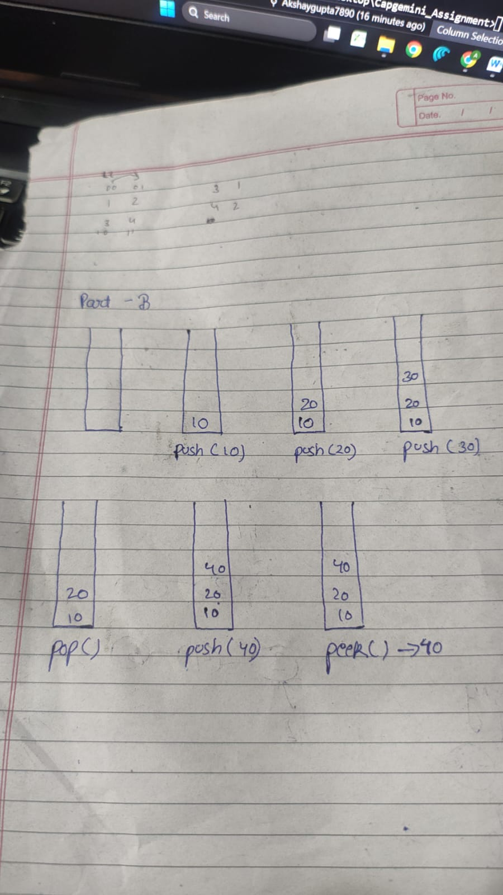

Stack – Complete Assignment Solution


## Part A: Conceptual Questions

### 1. Define Stack and explain LIFO principle  
A **Stack** is a linear data structure in which insertion and deletion are performed from only one end called **TOP**.  
It follows the **LIFO (Last In First Out)** principle, which means the last element inserted into the stack is the first one to be removed.

---

### 2. What is Stack Overflow and Stack Underflow?  
- **Stack Overflow** occurs when an element is pushed into a stack that is already full.  
- **Stack Underflow** occurs when an element is popped from an empty stack.

---

### 3. Real-life examples of Stack  
- Stack of plates in a cafeteria  
- Undo and Redo operations in text editors  
- Browser back and forward navigation  
- Call stack during function calls  
- Books stacked on a table  

---

### 4. Time complexity of Push and Pop operations  
- **Push Operation:** O(1)  
- **Pop Operation:** O(1)  

---

## Part B: Dry Run Activity (Stack Size = 5)

### Operations and TOP Value Tracking

| Operation | Stack Content | TOP |
|---------|--------------|-----|
| Push(10) | 10 | 0 |
| Push(20) | 10, 20 | 1 |
| Push(30) | 10, 20, 30 | 2 |
| Pop() | 10, 20 | 1 |
| Push(40) | 10, 20, 40 | 2 |
| Peek() | 10, 20, **40** | 2 |


## Part C: Java Program – Stack Using Array (User Input)

```java
import java.util.Scanner;

class StackArray {
    int[] stack;
    int top;
    int size;

    StackArray(int size) {
        this.size = size;
        stack = new int[size];
        top = -1;
    }

    void push(int value) {
        if (top == size - 1) {
            System.out.println("Stack Overflow");
            return;
        }
        stack[++top] = value;
        System.out.println(value + " pushed into stack");
    }

    void pop() {
        if (top == -1) {
            System.out.println("Stack Underflow");
            return;
        }
        System.out.println(stack[top--] + " popped from stack");
    }

    void peek() {
        if (top == -1) {
            System.out.println("Stack is empty");
            return;
        }
        System.out.println("Top element: " + stack[top]);
    }
}

public class StackUsingArray {
    public static void main(String[] args) {
        Scanner sc = new Scanner(System.in);
        StackArray s = new StackArray(5);

        while (true) {
            System.out.println("\n1.Push 2.Pop 3.Peek 4.Exit");
            int choice = sc.nextInt();

            switch (choice) {
                case 1:
                    System.out.print("Enter value: ");
                    s.push(sc.nextInt());
                    break;
                case 2:
                    s.pop();
                    break;
                case 3:
                    s.peek();
                    break;
                case 4:
                    System.exit(0);
            }
        }
    }
}

``` java
import java.util.Stack;
import java.util.Scanner;

public class BalancedParentheses {
    public static boolean isBalanced(String exp) {
        Stack<Character> stack = new Stack<>();

        for (char ch : exp.toCharArray()) {
            if (ch == '(' || ch == '{' || ch == '[') {
                stack.push(ch);
            } else {
                if (stack.isEmpty()) return false;
                char top = stack.pop();
                if ((ch == ')' && top != '(') ||
                    (ch == '}' && top != '{') ||
                    (ch == ']' && top != '[')) {
                    return false;
                }
            }
        }
        return stack.isEmpty();
    }

    public static void main(String[] args) {
        Scanner sc = new Scanner(System.in);
        System.out.print("Enter expression: ");
        String exp = sc.nextLine();

        if (isBalanced(exp))
            System.out.println("Balanced Expression");
        else
            System.out.println("Not Balanced Expression");
    }
}

# Stack Implementation Using Array in Java

## Objective
To understand stack operations, dry run behavior, and real-world problem solving using stack.

## Contents
- Stack definition and concepts
- Stack dry run with TOP tracking
- Java implementation of Stack using Array
- Balanced parentheses problem using Stack

## Technologies Used
- Java
- Scanner class
- Array-based Stack

## How to Run
1. Compile the Java files using `javac`
2. Run the program using `java ClassName`
3. Provide inputs through the console

## Output
- Push, Pop, and Peek operation results
- Balanced or Not Balanced expression output

## Conclusion
Stack is a linear data structure that follows the LIFO principle.  
It is widely used in recursion, expression evaluation, and undo operations.  
Array-based stack implementation is simple and efficient.  
Balanced parentheses checking is a classic stack application.  
Understanding stacks is essential for interviews and system design.
