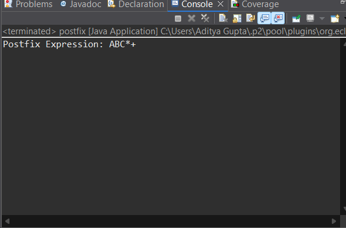

# 📘 Stack – Application Based Assignment (Complete Solution)

---

## 🔹 Part A: Application-Based Questions

### 1. How is stack used in function calls (Call Stack)?
When a function is called, its local variables, parameters, and return address are pushed onto the **call stack**.  
When the function execution completes, its stack frame is popped and control returns to the calling function.  
This ensures proper execution order, especially in recursive function calls.

---

### 2. How is stack used in Undo/Redo operations?
- **Undo** operation stores the last performed action on a stack.
- When undo is clicked, the last action is popped and reversed.
- **Redo** uses another stack to store undone actions.
This allows efficient backtracking of actions in LIFO order.

---

### 3. Why is stack useful in expression evaluation?
Stacks help manage **operators and operands** efficiently.  
They handle operator precedence, parentheses, and evaluation order, especially in postfix and prefix expressions.

---

### 4. Differentiate between Infix, Prefix, and Postfix expressions

| Type | Operator Position | Example |
|----|------------------|---------|
| Infix | Between operands | A + B |
| Prefix | Before operands | +AB |
| Postfix | After operands | AB+ |

---

## 🔹 Part B: Coding Activity 1 – Balanced Parentheses

### Algorithm
1. Create an empty stack.
2. Traverse the expression character by character.
3. Push opening brackets onto the stack.
4. For closing brackets, pop and check matching.
5. If stack is empty at the end → Balanced.




### Java Program
```java
import java.util.Stack;
import java.util.Scanner;

public class BalancedParentheses {
    public static boolean isBalanced(String exp) {
        Stack<Character> stack = new Stack<>();

        for (char ch : exp.toCharArray()) {
            if (ch == '(') {
                stack.push(ch);
            } else if (ch == ')') {
                if (stack.isEmpty()) return false;
                stack.pop();
            }
        }
        return stack.isEmpty();
    }

    public static void main(String[] args) {
        Scanner sc = new Scanner(System.in);
        System.out.print("Enter expression: ");
        String exp = sc.nextLine();

        if (isBalanced(exp))
            System.out.println("Balanced");
        else
            System.out.println("Not Balanced");
    }
}
``` java
import java.util.Stack;

public class InfixToPostfix {

    static int precedence(char ch) {
        if (ch == '+' || ch == '-') return 1;
        if (ch == '*' || ch == '/') return 2;
        return -1;
    }

    public static void main(String[] args) {
        String infix = "A+B*C";
        Stack<Character> stack = new Stack<>();
        String postfix = "";

        for (char ch : infix.toCharArray()) {
            if (Character.isLetterOrDigit(ch)) {
                postfix += ch;
            } else {
                while (!stack.isEmpty() && precedence(stack.peek()) >= precedence(ch)) {
                    postfix += stack.pop();
                }
                stack.push(ch);
            }
        }

        while (!stack.isEmpty()) {
            postfix += stack.pop();
        }

        System.out.println("Postfix Expression: " + postfix);
    }
}

```java
import java.util.Stack;

public class ReverseArrayUsingStack {
    public static void main(String[] args) {
        int[] arr = {1, 2, 3, 4, 5};
        Stack<Integer> stack = new Stack<>();

        for (int i = 0; i < arr.length; i++) {
            stack.push(arr[i]);
        }

        for (int i = 0; i < arr.length; i++) {
            arr[i] = stack.pop();
        }

        System.out.print("Reversed Array: ");
        for (int num : arr) {
            System.out.print(num + " ");
        }
    }
}


| Operation                  | Time Complexity |
| -------------------------- | --------------- |
| Push                       | O(1)            |
| Pop                        | O(1)            |
| Peek                       | O(1)            |
| Balanced Parentheses Check | O(n)            |

---

## Conclusion

Stack is a powerful linear data structure based on the LIFO principle.
It plays a vital role in function calls, expression evaluation, and undo/redo operations.
Stacks simplify complex problems like infix to postfix conversion.
They provide efficient constant-time operations for insertion and deletion.
Balanced parentheses checking is a classic real-world stack application.
Understanding stacks is essential for problem solving and interviews.